# Placenix — High-Level Design (HLD)
**AI-Powered Employability & Campus Recruitment Operating System**

---

## 1. Document Control & Executive Summary

### 1.1 Document Metadata
| Parameter | Details |
| :--- | :--- |
| **Document Title** | High-Level Design (HLD) Specification |
| **System Name** | Placenix (Campus Recruitment OS) |
| **Version** | 3.0.0 (Enterprise Production Architecture) |
| **Status** | Approved & Implemented |
| **Classification** | Proprietary / Technical Architecture Documentation |
| **Target Audience** | Enterprise Architects, Lead Engineers, Product Directors, Institutional CTOs |

### 1.2 Executive Summary
**Placenix** is a multi-tenant, role-governed Campus Recruitment and Employability Intelligence Operating System designed to digitize, automate, and optimize university placement operations. The platform bridges the gap between students, training & placement officers (TPOs), departmental coordinators, faculty advisors, and enterprise recruiters. 

Placenix features a **Zero-Build, Highly Resilient Client-Side Architecture** paired with a micro-proxy gateway and a Supabase BaaS (Backend-as-a-Service) persistence tier. Key capabilities include:
- **Autonomous AI Virtual Interview Simulation** powered by Google Gemini AI with client-side proctoring (TensorFlow.js BlazeFace & COCO-SSD).
- **Multi-Track ATS Resume Intelligence** and role-fit diagnostic scoring.
- **5-Pillar Employability Telemetry** generating real-time radar readiness metrics.
- **Dynamic Multi-Round Recruitment Kanban Pipelines** with real-time candidate progression.
- **Automated Multi-Venue Interview Slot Allocation** and real-time attendance verification.
- **7-Tier Whitelist-Enforced Role-Based Access Control (RBAC)** across multi-college hierarchies.

---

## 2. Strategic Vision & Architecture Goals

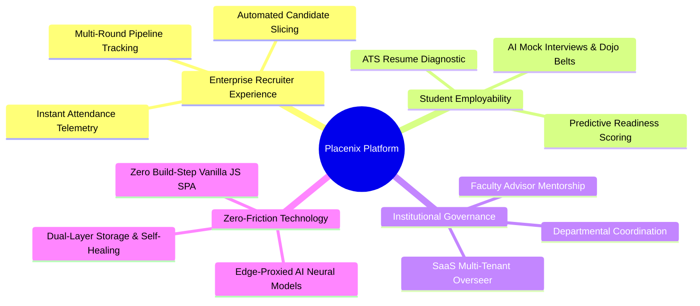

### 2.1 Key Design Principles
1. **Zero-Build Micro-Modular Architecture**: The client operates natively on ES Modules (`import`/`export`) without Webpack, Vite, or Babel build steps. This guarantees instant deployment, lightning boot speeds, and zero runtime bundler friction.
2. **Dual-Layer Resilient Persistence**: Placenix implements a hybrid storage architecture:
   - **Primary Remote Tier**: Supabase PostgreSQL with Row Level Security (RLS) and real-time subscriptions.
   - **Local Sandbox Tier**: Client-side reactive memory synchronized with `localStorage` and automated self-healing algorithms (`healData()`) that guarantee zero data loss during network degradation.
3. **Defense-in-Depth Whitelist RBAC**: Strict route and view gating ensures users cannot view or manipulate state outside their authorized institutional scope.
4. **Edge AI Compute & Privacy-First Proctoring**: Heavy computer vision tasks (facial orientation, multi-person detection, mobile phone detection) run purely on-device via TensorFlow.js WebGL backends, sending zero video streams over the network.

---

## 3. High-Level Architecture & Topology

### 3.1 C4 Context Diagram (Level 1)
The following diagram illustrates how various institutional actors interact with the Placenix platform and its external systems:

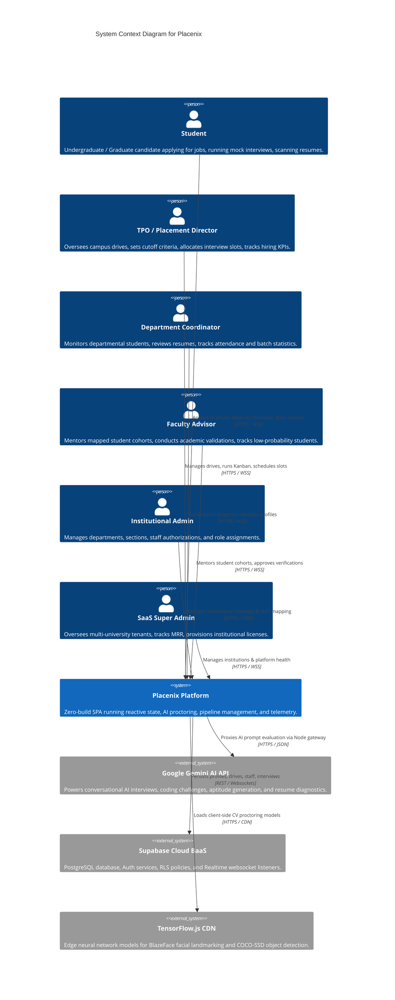

---

### 3.2 C4 Container Diagram (Level 2)
The internal containerized architecture of the Placenix runtime environment:

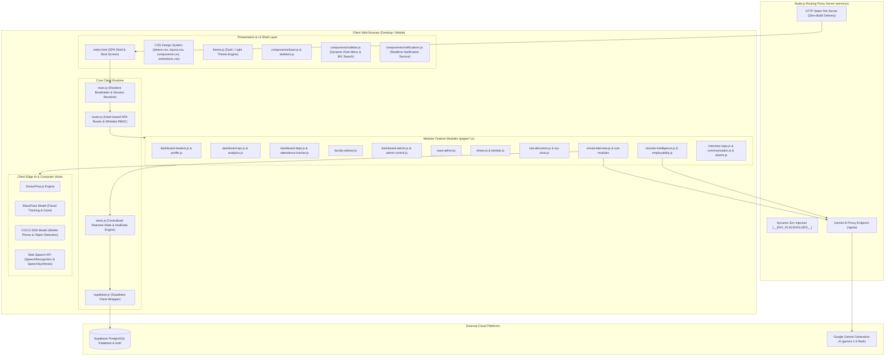

---

## 4. Core Subsystems & Service Modules

### 4.1 Role-Based Access Control (RBAC) & Security Gateway
Placenix enforces a **strict whitelist security model**. Rather than checking blacklist permissions, the router cross-checks every target route against the authenticated user's explicit role matrix:

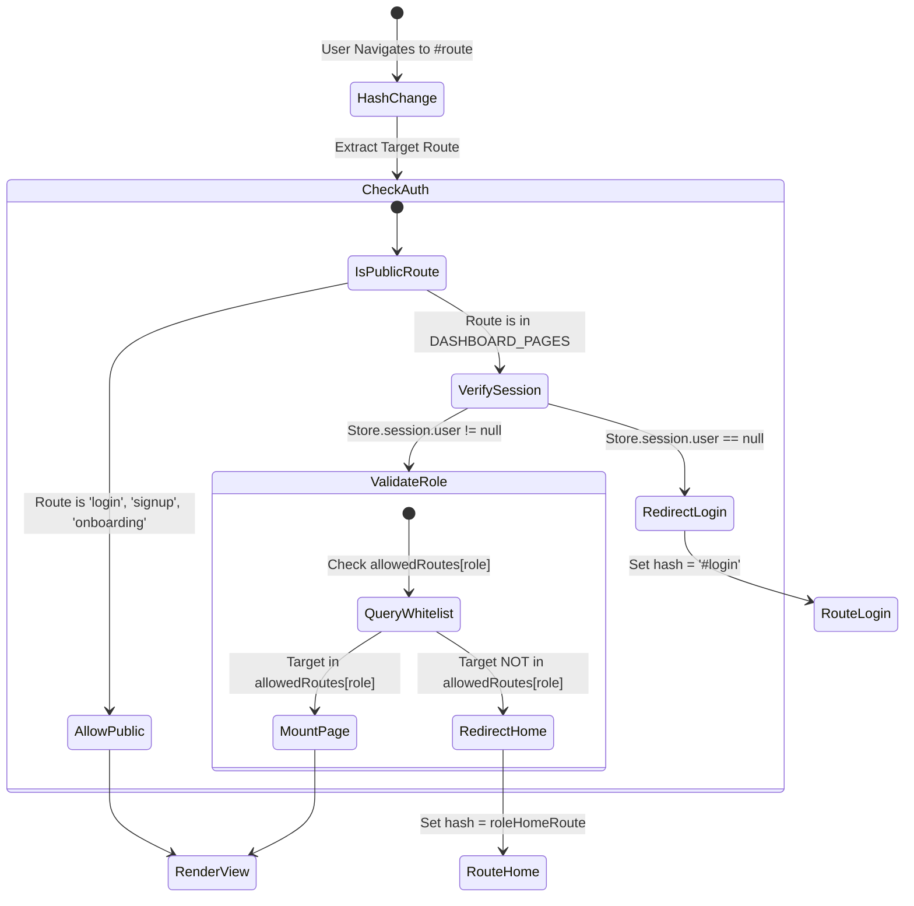

#### Supported User Roles & Default Landings
| User Role | Home Route | Domain Scope & Accessible Views |
| :--- | :--- | :--- |
| `student` | `#student-dashboard` | Opportunities, AI Mock Interviews, ATS Resume Scanner, Employability Radar, My Slots, Alumni Network, Queries |
| `tpo` | `#tpo-dashboard` | Drive Master Registry, Multi-Round Kanban Pipeline, Slot Allocator, Round-Wise Attendance, Institutional Analytics |
| `coordinator` | `#coordinator-dashboard` | Departmental Student Grid, Resume Validation, Job Feeds, Slot Monitor, Attendance, Announcements, Queries |
| `department` | `#coordinator-dashboard` | Same as coordinator (Departmental Governance & Tracking) |
| `faculty` | `#faculty-dashboard` | Mentoring Cohort, At-Risk Student Filtering, Skill Gap Telemetry, Academic Validations, Attendance Tracking |
| `admin` | `#admin-dashboard` | Departments & Sections Hierarchy, Staff Authorization, Role Permissions, Operational Work Mapping |
| `saas-admin` | `#saas-admin` | Multi-Tenant University Registry, MRR & Subscription Tier Monitoring, Tenant Provisioning |

---

### 4.2 Reactive Central Store & Self-Healing Telemetry Engine
The `store.js` module acts as the single source of truth for the client. It provides:
1. **Computed Telemetry Engine (`Store.analytics`)**: Calculates aggregate hiring percentages, CTC package distributions (LPA buckets), department-wise averages, and cumulative monthly hiring trajectories dynamically from raw student and drive arrays.
2. **Self-Healing Data Reconciler (`healData()`)**:
   - De-duplicates student records by ID and normalized full name.
   - Cleans orphan applications referencing deleted recruitment drives.
   - Normalizes Kanban cards ensuring a student is pinned only to their latest active stage per drive.
   - Reconciles allocated slots and prunes deleted drive associations.
3. **Two-Way Synchronization Pipeline**: Automatically writes changes to `localStorage` and triggers cross-tab synchronization via `CustomEvent('store-updated')` and `Event('storage')`.

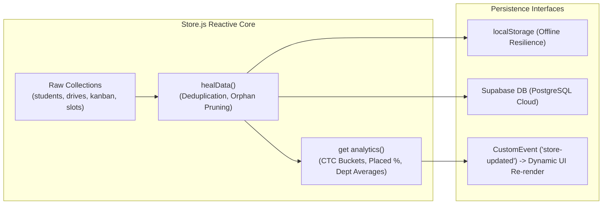

---

### 4.3 Virtual Interview Simulation & Edge AI Proctoring Grid
The Virtual Interview engine (`pages/virtual-interview.js`) is an end-to-end multi-round AI evaluation suite supporting:

```mermaid
sequenceDiagram
    autonumber
    actor Candidate as Student Candidate
    participant UI as Virtual Interview UI
    participant CV as TensorFlow.js (BlazeFace / COCO-SSD)
    participant Audio as Web Speech API (STT / TTS)
    participant Proxy as Node /api/ai Proxy
    participant Gemini as Google Gemini 1.5 Flash
    participant PDF as PDF Generator (jspdf)

    Candidate->>UI: Selects Company (e.g. Google, Amazon, TCS) & Role
    UI->>UI: Mounts Setup & Requests Camera/Microphone Permissions
    UI->>CV: Initializes BlazeFace & COCO-SSD Models on Canvas
    
    rect rgb(20, 30, 45)
        note over UI,Gemini: Round 1 — Adaptive Aptitude Test (30 Questions)
        UI->>Proxy: generateAptitudeQuestions(company, role)
        Proxy->>Gemini: Request customized Quants, Logical, Verbal, Tech MCQs
        Gemini-->>UI: Returns 30 structured MCQs
        Candidate->>UI: Answers MCQs under Timer & CV Proctoring
        UI->>UI: Calculates Aptitude Score vs Company Cutoff Threshold
    end

    rect rgb(25, 25, 40)
        note over UI,Gemini: Round 2 — Live Coding & Technical Challenge
        UI->>Proxy: generateTechnicalChallenge(company, role, facedList)
        Proxy->>Gemini: Requests role-specific DSA / SQL challenge & test cases
        Gemini-->>UI: Returns Problem, Starter Code (JS/Python/SQL), and Test Cases
        Candidate->>UI: Writes code in in-browser IDE
        UI->>Proxy: runCodeAI(code, language, testCases)
        Proxy->>Gemini: Evaluates syntax, execution correctness, time complexity
        Gemini-->>UI: Test cases pass/fail telemetry + score
    end

    rect rgb(20, 35, 30)
        note over UI,Gemini: Round 3 & 4 — Conversational AI & Behavioral HR Fit
        UI->>Audio: AI speaks prompt question using SpeechSynthesis
        Candidate->>Audio: Candidate speaks answer via SpeechRecognition (STT)
        Audio-->>UI: Transcribes audio stream to text in real-time
        UI->>Proxy: evaluateHRFit(transcript, history, companyValues)
        Proxy->>Gemini: Evaluates STAR framework, confidence, leadership
        Gemini-->>UI: Returns HR evaluation, grading score, and feedback
    end

    UI->>PDF: downloadReportPDF(candidateReportData)
    PDF-->>Candidate: Downloads Detailed AI Diagnostic & Dojo Belt Certificate
```

#### Proctoring Violation Detection Engine
- **Multiple Face Detection**: Triggers warning if $> 1$ face is identified in the webcam frame.
- **Out of Frame / Gaze Deviation**: Triggers warning if 0 faces are detected for $> 5$ seconds.
- **Prohibited Device Detection**: COCO-SSD continuously identifies `cell phone`, `book`, or `laptop` classes.
- **Tab Switching Guard**: Tracks `visibilitychange` events; $> 3$ tab switches terminates the interview session.

---

### 4.4 Multi-Round Recruitment Kanban Pipeline
The Kanban system (`pages/kanban.js`) transforms static recruitment listings into an interactive drag-and-drop talent pipeline:

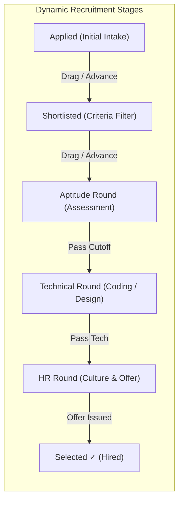

- **Dynamic Round Injection**: Columns automatically adapt to the specific rounds defined in the active recruitment drive (e.g., *Online Assessment* $\rightarrow$ *System Design* $\rightarrow$ *Bar Raiser* for Amazon vs *Aptitude* $\rightarrow$ *C Coding* $\rightarrow$ *HR* for Zoho).
- **Two-Way Synchronization**: Moving a candidate to `Selected ✓` automatically marks the student as `Placed` in `Store.students`, records their company CTC, updates the college placement percentage, and synchronizes the TPO dashboard.

---

### 4.5 Automated Multi-Venue Slot Allocation & Attendance Matrix
The Slot Allocation engine (`pages/slot-allocation.js` & `pages/attendance-tracker.js`) eliminates campus interview scheduling congestion:

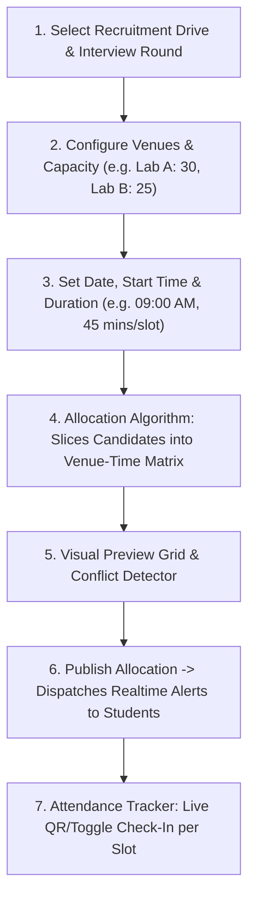

---

### 4.6 Resume Intelligence & Employability Telemetry

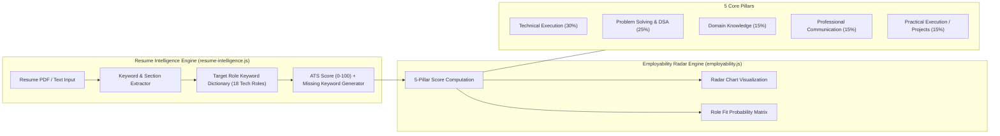

---

## 5. Data Flow Architecture & Database Schema

### 5.1 Relational Data Model (Supabase PostgreSQL)

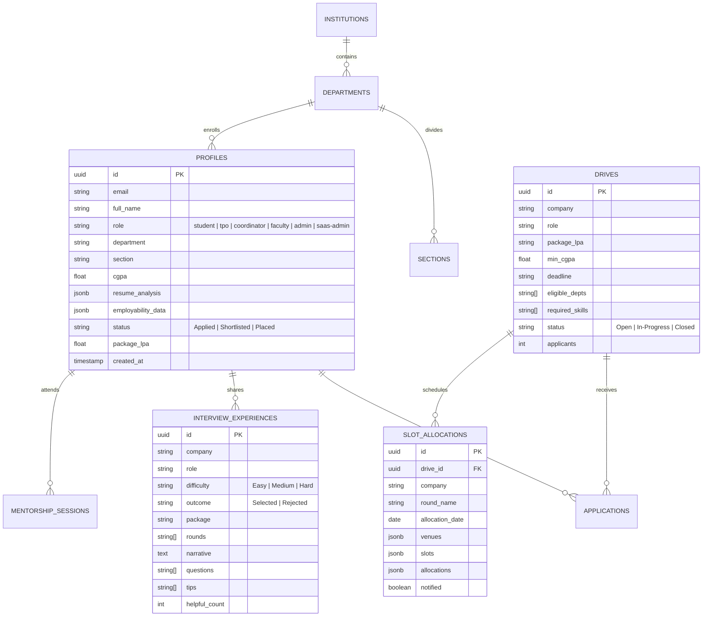

---

## 6. Security, Privacy & Non-Functional Architecture

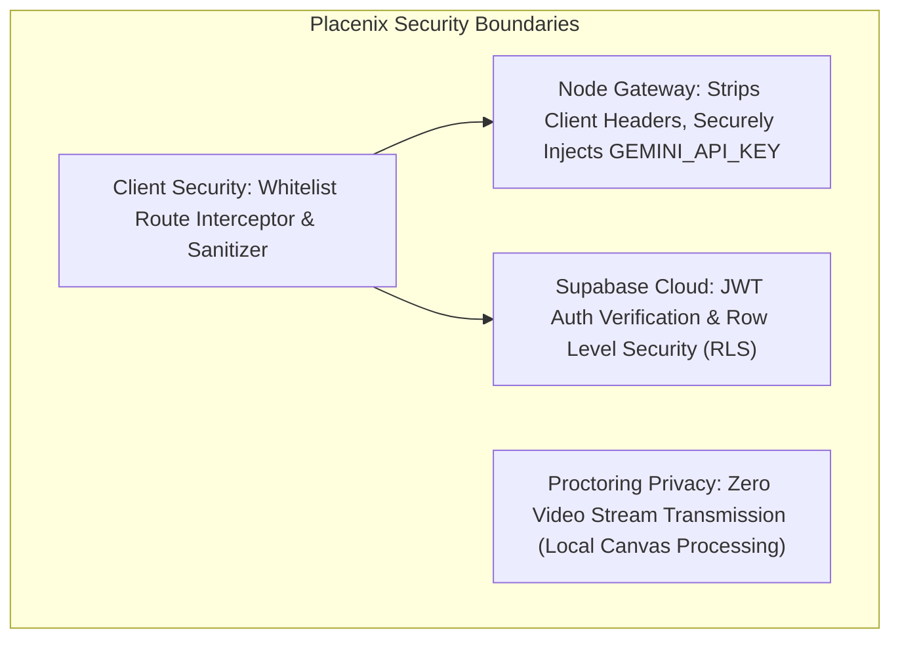

### 6.1 Non-Functional Requirements (NFR) Performance Metrics
| Dimension | Target Metric | Architectural Mechanism |
| :--- | :--- | :--- |
| **Initial Page Load** | $< 800\text{ ms}$ | Zero-build Vanilla JS; static HTTP delivery; preloaded CSS tokens. |
| **Route Transition** | $< 50\text{ ms}$ | Hash-based client-side routing; skeleton placeholder transitions. |
| **AI Prompt Roundtrip** | $< 2.5\text{ s}$ | Lightweight Node proxy passing raw stream directly to `gemini-1.5-flash`. |
| **Data Integrity** | $100\%$ Zero Data Loss | Dual persistence layer + `healData()` auto-deduplication on startup. |
| **Browser Compatibility** | Chrome, Edge, Safari, Firefox | Standard ECMAScript 2022, WebRTC, HTML5 Canvas, Web Speech API. |
| **Mobile Responsiveness** | $320\text{px}$ to $4\text{K}$ screens | Fluid CSS Grid, glassmorphism flex containers, mobile drawer sidebar. |

---

## 7. Deployment & Infrastructure Architecture

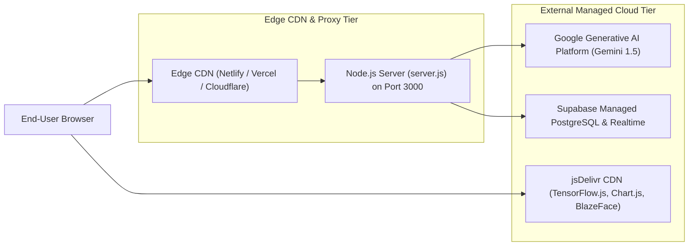

### 7.1 Environment Configuration Matrix
| Variable Name | Scope | Description |
| :--- | :--- | :--- |
| `PORT` | Server-side | HTTP listen port for static server and API proxy (Default: `3000`). |
| `GEMINI_API_KEY` | Server-side (Secret) | Google Cloud Gemini API key for proxying `/api/ai`. |
| `SUPABASE_URL` | Client-injected | Project URL for Supabase BaaS connection. |
| `SUPABASE_ANON_KEY` | Client-injected | Public anon key for client-side JWT token creation and queries. |
