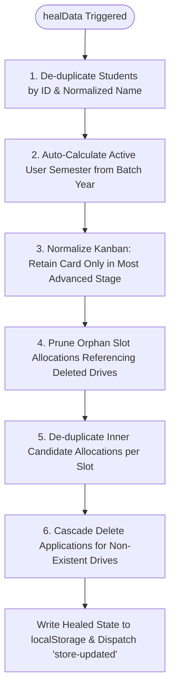
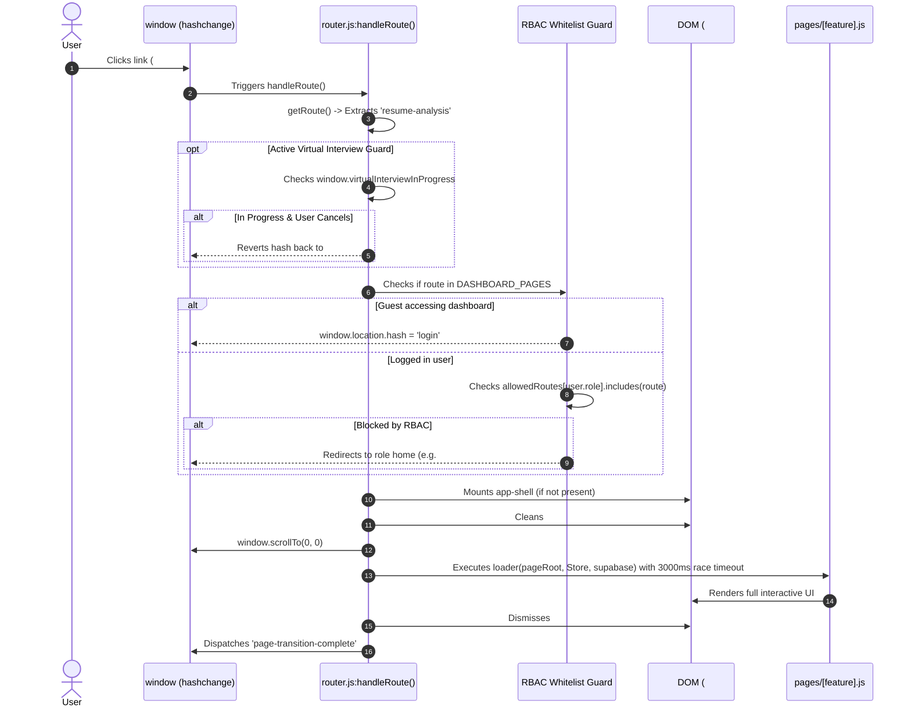
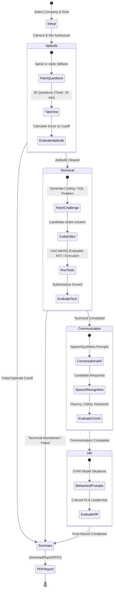
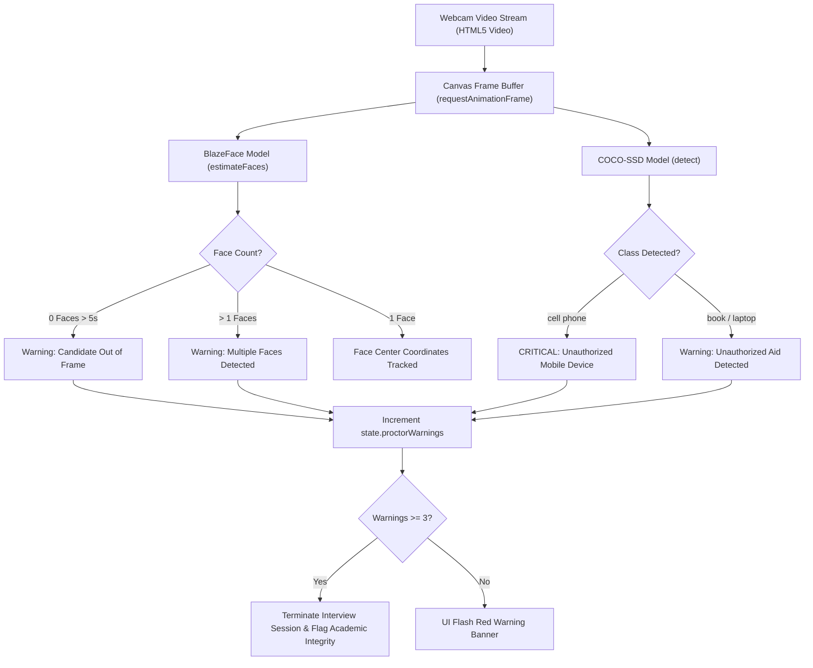
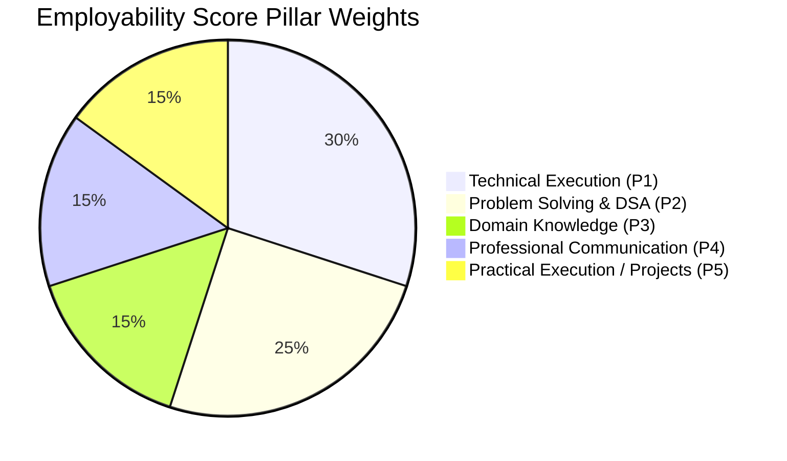

# Placenix — Low-Level Design (LLD)
**Technical Implementation & Component-Level Specification**

---

## 1. Document Control & Scope

### 1.1 Document Metadata
| Parameter | Details |
| :--- | :--- |
| **Document Title** | Low-Level Design (LLD) Specification |
| **System Name** | Placenix (Campus Recruitment OS) |
| **Version** | 3.0.0 (Production Codebase Architecture) |
| **Status** | Approved & Implemented |
| **Primary Code Base** | JavaScript (ES Modules, Vanilla DOM, Web APIs), Supabase SQL, Node.js |
| **Target Audience** | Software Engineers, Full-Stack Developers, Code Reviewers, Systems Integrators |

### 1.2 Scope & Purpose
This document provides the exhaustive, implementation-level technical architecture of the Placenix codebase. It details the internal algorithms, data structures, state machines, function signatures, DOM manipulation lifecycles, database schemas, and AI prompt engineering strategies implemented across the repository.

---

## 2. Directory Structure & Module Topology

```
Placenix/
├── index.html                   # SPA Shell & Global Bootstrapper (CDNs, Error Boundaries)
├── main.js                      # Application Entry Point & Authentication Lifecycle
├── router.js                    # Centralized Hash SPA Router & Whitelist RBAC Guards
├── store.js                     # Centralized Reactive Intelligence Store (v2.7) & healData()
├── supabase.js                  # Ultra-Resilient Supabase Client Wrapper
├── server.js                    # Node.js Static Server & Gemini AI Proxy (/api/ai)
├── theme.js                     # Dark/Light Theme & Dynamic Color Palette Manager
├── package.json                 # Project Metadata & Scripts
│
├── components/                  # Global Reusable UI Components
│   ├── sidebar.js               # Dynamic Role-Aware Sidebar & ⌘K Search Topbar
│   ├── notifications.js         # Realtime Notification Engine & Read-State Tracker
│   ├── network.js               # Offline/Online Connectivity Monitor & Banner
│   ├── skeleton.js              # Shimmer Loading Skeleton Generators (Dashboard / List)
│   └── toast.js                 # Global Floating Toast Notification System
│
├── pages/                       # Feature-Level View Controllers
│   ├── landing.js               # Public Marketing & Platform Showcase Page
│   ├── auth.js                  # Enterprise Login, Signup & OTP Verification Workspaces
│   ├── onboarding.js            # Initial User Profile Setup & Academic Onboarding
│   ├── dashboard-student.js     # Student Operational Dashboard & Telemetry
│   ├── dashboard-tpo.js         # TPO Executive Placement Cockpit & Shared Prep Hub
│   ├── dashboard-dept.js        # Departmental Coordinator Intelligence Hub
│   ├── dashboard-admin.js       # Institutional Admin Governance & Setup Dashboard
│   ├── faculty-advisor.js       # Faculty Mentoring, Cohort Filtering & Validation System
│   ├── admin-control.js         # Department, Section, Staff & Role Management Workspace
│   ├── admin-dept.js            # Department-Specific Administrator Controls
│   ├── drives.js                # Recruitment Drives, Eligibility Matrix & Application Flow
│   ├── kanban.js                # Dynamic Multi-Round Drag-and-Drop Recruitment Pipeline
│   ├── slot-allocation.js       # Multi-Venue Interview Scheduling & Batch Allocator
│   ├── my-slots.js              # Student & Coordinator Interview Slot Viewer
│   ├── attendance-tracker.js    # Round-Wise Live Attendance & Verification Tracker
│   ├── profile.js               # Comprehensive Student Profile & Verification Vault
│   ├── resume-intelligence.js   # ATS Keyword Scanner & Role-Fit Diagnostic Suite
│   ├── employability.js         # 5-Pillar Employability Telemetry & Radar Engine
│   ├── ai-modules.js            # Predictive Placement Probability & AI Laboratory
│   ├── virtual-interview.js     # Autonomous Multi-Round AI Interview Simulation Hub
│   ├── interview-repo.js        # Peer-Shared Company Interview Experiences Archive
│   ├── alumni.js                # Alumni Mentorship Network & Global Directory
│   ├── analytics.js             # Institutional Analytics, Charts & Export Utilities
│   ├── communication.js         # Broadcast Channels & Student Query Resolution Center
│   ├── saas-admin.js            # SaaS Multi-Tenant Platform Control & MRR Monitor
│   │
│   └── virtual-interview/       # Virtual Interview Dedicated Sub-Modules
│       ├── ai-helpers.js        # Gemini AI Prompt Constructers & Code Execution Evaluator
│       ├── dojo-belts.js        # Dojo Belt Tier Configurations & Benchmark Challenges
│       ├── pdf-generator.js     # Canvas-to-PDF Diagnostic Report Generator
│       └── static-data.js       # Offline Fallback Question Pools & Coding Problems
│
└── style/                       # CSS Design System
    ├── tokens.css               # Design Tokens (HSL Colors, Spacing, Shadows, Radii)
    ├── reset.css                # Universal CSS Reset & Base Typography Settings
    ├── layout.css               # App Shell, Flex/Grid Layouts, Sidebar & Topbar Styles
    ├── components.css           # Buttons, Cards, Inputs, Modals, Pills & Badges
    └── animations.css           # Hardware-Accelerated Keyframes & Transitions
```

---

## 3. Central Intelligence Store Architecture (`store.js`)

### 3.1 Singleton State Schema
`Store` is exported as a centralized, mutable state singleton with the following structure:

```typescript
interface PlacenixStore {
  session: {
    role: 'guest' | 'student' | 'tpo' | 'coordinator' | 'department' | 'faculty' | 'admin' | 'saas-admin';
    user: UserProfile | null;
  };
  students: StudentRecord[];
  drives: DriveRecord[];
  alumni: AlumniRecord[];
  interviews: InterviewExperienceRecord[];
  institutions: InstitutionRecord[];
  departments: DepartmentRecord[];
  slotAllocations: SlotAllocationRecord[];
  notifications: NotificationRecord[];
  sharedResources: PrepResourceRecord[];
  queries: QueryRecord[];
  kanban: {
    applied: KanbanCard[];
    shortlisted: KanbanCard[];
    aptitude: KanbanCard[];
    technical: KanbanCard[];
    hr: KanbanCard[];
    selected: KanbanCard[];
    [customRound: string]: KanbanCard[];
  };
  studentProfile: {
    applications: StudentApplication[];
    skills: {
      technical: number;
      communication: number;
      problemSolving: number;
      domainKnowledge: number;
      collaboration: number;
    };
  };
  analytics: ComputedAnalytics; // Dynamic Getter
}
```

---

### 3.2 Dynamic Telemetry Computation Engine (`get analytics()`)
The `analytics` getter dynamically computes aggregate metrics on invocation without storing stale counters:

```javascript
get analytics() {
  const s = this.students || [];
  const d = this.drives || [];
  
  // 1. Placement Telemetry
  const placedStudents = s.filter(x => x.placed || x.status === 'Placed');
  const placedCount = placedStudents.length;
  const totalStudentsCount = s.length || 180;
  const placementPercent = s.length ? ((placedCount / s.length) * 100).toFixed(1) : '78.4';
  
  // 2. Package Telemetry (LPA)
  const studentPackages = placedStudents.map(x => parseFloat(x.package) || 0).filter(p => p > 0);
  const drivePackages = d.map(x => parseFloat(x.package) || 0).filter(p => p > 0);
  const allPackages = [...studentPackages, ...drivePackages];
  if (allPackages.length === 0) allPackages.push(8.5, 12.0, 14.5, 24.0, 32.0, 6.5, 7.2, 10.0, 18.0, 44.0);
  
  const avgPkgVal = allPackages.length ? (allPackages.reduce((a,b)=>a+b,0)/allPackages.length).toFixed(1) : '9.8';
  const maxPkgVal = allPackages.length ? Math.max(...allPackages).toFixed(1) : '44.0';
  
  // 3. Package Distribution Buckets
  const pkgBuckets = [
    { range: '< 3 LPA',   min: 0,  max: 3  },
    { range: '3 – 6 LPA', min: 3,  max: 6  },
    { range: '6 – 10 LPA',min: 6,  max: 10 },
    { range: '10 – 15 LPA',min:10, max: 15 },
    { range: '> 15 LPA',  min: 15, max: Infinity }
  ];
  let packageDistribution = pkgBuckets.map(b => ({
    range: b.range,
    count: allPackages.filter(p => p >= b.min && p < b.max).length
  }));

  // 4. Department-Wise Placement Breakdown
  const defaultDepts = ['CSE', 'IT', 'ECE', 'MECH', 'AI&DS'];
  const depts = Array.from(new Set([...s.map(x => x.dept).filter(Boolean), ...defaultDepts]));
  const byDept = depts.map(dept => {
    const deptStudents = s.filter(x => (x.dept || '').toUpperCase() === dept.toUpperCase());
    const deptPlaced   = deptStudents.filter(x => x.placed || x.status === 'Placed');
    const deptPkgs     = deptPlaced.map(x => parseFloat(x.package) || 0).filter(p => p > 0);
    return {
      dept,
      total: deptStudents.length || 60,
      placed: deptStudents.length ? deptPlaced.length : 45,
      avgPkg: deptPkgs.length ? (deptPkgs.reduce((a,b)=>a+b,0)/deptPkgs.length).toFixed(1) : '8.5',
      highPkg: deptPkgs.length ? Math.max(...deptPkgs).toFixed(1) : '24.0'
    };
  });

  return {
    overall: {
      totalStudents: s.length || totalStudentsCount,
      placed: placedCount,
      placementPercent,
      avgPackage: `${avgPkgVal} LPA`,
      highestPackage: `${maxPkgVal} LPA`,
      activeRecruiters: new Set(d.map(x => x.company)).size || 12,
      drivesCompleted: d.filter(x => x.status === 'Closed').length || 14
    },
    byDept,
    packageDistribution
  };
}
```

---

### 3.3 Data Self-Healing Engine (`healData()`)
`healData()` runs automatically upon boot and after remote synchronization to enforce strict data integrity invariants:



#### Detailed Healing Logic
1. **Student Deduplication**: Filters out placeholder names (`'arjun ram'`, `'neha sharma'`) and eliminates multiple records with identical lowercase names.
2. **Kanban Card Monotonicity**: Iterates from most advanced (`selected`) down to earliest (`applied`) stage. If candidate `srithikan_s_amazon` is present in `technical`, it is removed from `aptitude` and `applied`.
3. **Slot Integrity Reconciler**: Prunes any slot allocation whose `driveId` or `company` no longer exists in `Store.drives`.
4. **Semester Math**: Auto-derives `current_semester` from `batch_year` using:
   $$\text{Semester} = (\text{CurrentYear} - \text{BatchStartYear}) \times 2 + (\text{CurrentMonth} \ge 6 \ ? \ 1 : 0)$$

---

## 4. SPA Router & Whitelist RBAC Pipeline (`router.js`)

### 4.1 Routing Lifecycle & Execution Flow



### 4.2 Whitelist RBAC Definition Matrix
```javascript
const allowedRoutes = {
  'student': [
    'student-dashboard', 'student-details', 'profile', 'resume-analysis', 'resume', 
    'employability', 'skill-analysis', 'ai-modules', 'ai-predictor',
    'new-applications', 'my-applications', 'my-slots', 'alumni-connect', 'alumni',
    'communication', 'queries', 'virtual-interview', 'interview-repo'
  ],
  'tpo': [
    'tpo-dashboard', 'drives', 'kanban', 'attendance-tracker', 'slot-allocation',
    'alumni-connect', 'alumni', 'profile', 'student-details', 'analytics', 'completed-batches',
    'new-applications', 'interview-repo', 'virtual-interview'
  ],
  'coordinator': [
    'coordinator-dashboard', 'department-dashboard', 'dept-students', 'dept-resume',
    'dept-skills', 'dept-new-jobs', 'dept-prev-jobs', 'attendance-tracker', 'slot-allocation', 'my-slots',
    'dept-announcements', 'dept-queries', 'alumni-connect', 'alumni', 'profile', 'student-details', 'analytics', 'virtual-interview'
  ],
  'faculty': [
    'faculty-dashboard', 'fa-students', 'fa-resume', 'fa-skills', 'fa-new-jobs',
    'fa-prev-jobs', 'attendance-tracker', 'slot-allocation', 'my-slots', 'alumni-connect', 'alumni', 'profile', 'student-details', 'virtual-interview'
  ],
  'admin': [
    'admin-dashboard', 'admin-setup', 'admin-staff', 'admin-roles', 'admin-mapping',
    'alumni-connect', 'alumni', 'profile', 'student-details', 'virtual-interview'
  ],
  'saas-admin': [
    'saas-admin', 'alumni-connect', 'alumni', 'profile', 'student-details', 'virtual-interview'
  ]
};
```

---

## 5. Virtual Interview Subsystem Deep Dive (`pages/virtual-interview.js`)

### 5.1 Interview State Machine



---

### 5.2 AI Prompt Engineering Specifications (`ai-helpers.js`)

#### 1. Aptitude Generator (`generateAptitudeQuestions`)
- **System Prompt**: Senior recruitment examiner at target company.
- **Distribution Constraint**: Exactly 30 questions (8 Quantitative, 7 Logical, 8 Verbal, 7 Technical).
- **Format**: JSON schema `{ questions: [ { q: string, opts: [s1, s2, s3, s4], ans: 0..3 } ] }`.
- **Latency Control**: AbortController timeout of 4000ms with seamless fallback to `staticQuestionPool`.

#### 2. Technical Challenge Generator (`generateTechnicalChallenge`)
- **Schema**:
```json
{
  "title": "string",
  "description": "HTML string with constraints and examples",
  "languages": ["JavaScript", "Python", "SQL"],
  "templates": {
    "JavaScript": "function solve(...) { ... }",
    "Python": "def solve(...): ...",
    "SQL": "SELECT ... FROM ..."
  },
  "testCases": [
    { "input": "...", "output": "..." }
  ]
}
```

#### 3. Code Evaluator (`runCodeAI`)
- **Evaluation Dimensions**: Functional correctness against test cases, time complexity $O(n)$, space complexity $O(1)$, edge case handling (nulls, overflows, empty inputs).

---

### 5.3 Computer Vision & Proctoring Engine



---

### 5.4 Dojo Belts Progression Schema (`dojo-belts.js`)
Candidates advance through 8 distinct martial arts-inspired belts based on their cumulative interview scores and difficulty mastery:

| Belt Level | Name | Minimum Score Required | Target CTC Tier | Difficulty Benchmark |
| :--- | :--- | :---: | :---: | :--- |
| 🥋 **White** | Initiate | $0\%$ | 3.5 – 5.0 LPA | Basic I/O, loops, arithmetic aptitude |
| 🥋 **Yellow** | Apprentice | $60\%$ | 5.0 – 7.0 LPA | Arrays, strings, linear search, basic OOP |
| 🥋 **Orange** | Practitioner | $68\%$ | 7.0 – 10.0 LPA | Stack, queue, recursion, binary search |
| 🥋 **Green** | Specialist | $75\%$ | 10.0 – 14.0 LPA | Trees, BST, hashing, greedy algorithms |
| 🥋 **Blue** | Expert | $82\%$ | 14.0 – 18.0 LPA | Graphs, dynamic programming, SQL indexing |
| 🥋 **Purple** | Master | $88\%$ | 18.0 – 24.0 LPA | Trie, segment trees, concurrency, system design |
| 🥋 **Brown** | Grandmaster | $92\%$ | 24.0 – 32.0 LPA | Distributed caching, sharding, complex DP |
| 🥋 **Black** | Legend | $96\%$ | $32.0+$ LPA | High-throughput low-latency micro-architectures |

---

## 6. Resume Intelligence & Employability Mathematical Models

### 6.1 ATS Keyword Matching Equation (`resume-intelligence.js`)
Given target role keyword set $K_{\text{target}}$ and extracted resume terms $T_{\text{resume}}$:

$$\text{Found Keywords} \ S = \{k \in K_{\text{target}} \mid k \in T_{\text{resume}}\}$$

$$\text{ATS Base Score} = \min\left(100, \ \text{round}\left(\frac{|S|}{|K_{\text{target}}|} \times 100 \times 1.25\right)\right)$$

- Missing keywords are computed as $M = K_{\text{target}} \setminus S$.
- History is saved to `localStorage` under `placenix_profile_cache` with a sliding window of max 8 entries to avoid storage exhaustion.

---

### 6.2 5-Pillar Employability Scoring Model (`employability.js`)



#### Mathematical Formulation
1. **Technical Pillar ($P_1$)**:
   $$P_1 = \min(97, \max(55, \text{round}(\text{ATS} \times 0.65 + \min(|S| \times 3.5, 32))))$$
2. **Problem Solving Pillar ($P_2$)**:
   $$P_2 = \min(95, \max(52, \text{round}(\text{ATS} \times 0.60 + (\text{CGPA} \ge 8.0 \ ? \ 25 : 16))))$$
3. **Domain Knowledge Pillar ($P_3$)**:
   $$P_3 = \min(98, \max(58, \text{round}((\text{CGPA} \times 10) \times 0.72 + 24)))$$
4. **Communication Pillar ($P_4$)**:
   $$P_4 = \min(94, \max(62, \text{round}(\text{ATS} \times 0.45 + 45)))$$
5. **Practical Execution Pillar ($P_5$)**:
   $$P_5 = \min(96, \max(50, \text{round}(N_{\text{docs}} \times 14 + N_{\text{exp}} \times 18 + 36)))$$

#### Composite Overall Employability Score ($E_{\text{composite}}$)
$$E_{\text{composite}} = \text{round}(0.30 P_1 + 0.25 P_2 + 0.15 P_3 + 0.15 P_4 + 0.15 P_5)$$

---

## 7. Multi-Venue Slot Allocation & Attendance Algorithms

### 7.1 Slot Slicing & Candidate Assignment Algorithm (`slot-allocation.js`)
Given $N$ total shortlisted candidates, a list of venues $V = [v_1, v_2, \dots, v_k]$ each with capacity $C(v_i)$, slot duration $T_{\text{dur}}$ (mins), and start time $T_{\text{start}}$:

```javascript
export function computeSlotAllocations(candidates, venues, numSlots, durationMinutes, startTimeStr, dateStr) {
  let [startHour, startMin] = startTimeStr.split(':').map(Number);
  let candidateIndex = 0;
  const allocations = [];
  const slotsList = [];

  for (let slotIdx = 0; slotIdx < numSlots; slotIdx++) {
    // 1. Calculate Time Range
    const slotStartMinTotal = startHour * 60 + startMin + slotIdx * durationMinutes;
    const slotEndMinTotal = slotStartMinTotal + durationMinutes;
    
    const timeLabel = `${formatTime(slotStartMinTotal)} - ${formatTime(slotEndMinTotal)}`;
    const slotId = `slot_${slotIdx + 1}`;
    slotsList.push({ id: slotId, time: timeLabel });

    // 2. Distribute Candidates Across Venues for this Slot
    venues.forEach(venue => {
      const cap = venue.capacity;
      const venueCandidates = candidates.slice(candidateIndex, candidateIndex + cap);
      candidateIndex += venueCandidates.length;

      venueCandidates.forEach(student => {
        allocations.push({
          studentId: student.id,
          studentName: student.name,
          dept: student.dept,
          regNo: student.regNo || 'N/A',
          slotId: slotId,
          slotTime: timeLabel,
          venueName: venue.name,
          date: dateStr,
          attendance: 'pending' // 'pending' | 'present' | 'absent'
        });
      });
    });
  }

  return {
    slots: slotsList,
    allocations,
    totalAllocated: allocations.length,
    remainingCount: Math.max(0, candidates.length - candidateIndex)
  };
}
```

---

## 8. Database Schema & SQL Table Definitions

```sql
-- 1. Profiles Table (Global User Directory & RBAC)
CREATE TABLE IF NOT EXISTS public.profiles (
    id UUID PRIMARY KEY REFERENCES auth.users(id) ON DELETE CASCADE,
    email TEXT UNIQUE NOT NULL,
    full_name TEXT NOT NULL,
    role TEXT NOT NULL CHECK (role IN ('student', 'tpo', 'coordinator', 'department', 'faculty', 'admin', 'saas-admin', 'system')),
    department TEXT,
    section TEXT,
    register_number TEXT,
    cgpa NUMERIC(4,2) DEFAULT 0.00,
    batch_year TEXT,
    current_semester INT,
    avatar_url TEXT,
    status TEXT DEFAULT 'Applied' CHECK (status IN ('Applied', 'Shortlisted', 'Placed', 'Rejected')),
    placed_date TIMESTAMPTZ,
    package_lpa NUMERIC(5,2),
    company TEXT,
    resume_analysis JSONB DEFAULT '{}'::jsonb,
    employability_data JSONB DEFAULT '{}'::jsonb,
    documents JSONB DEFAULT '[]'::jsonb,
    experiences JSONB DEFAULT '[]'::jsonb,
    skills TEXT[] DEFAULT ARRAY[]::TEXT[],
    created_at TIMESTAMPTZ DEFAULT NOW(),
    updated_at TIMESTAMPTZ DEFAULT NOW()
);

-- 2. Drives Table (Campus Recruitment Drives)
CREATE TABLE IF NOT EXISTS public.drives (
    id UUID PRIMARY KEY DEFAULT gen_random_uuid(),
    company TEXT NOT NULL,
    role TEXT NOT NULL,
    package_lpa NUMERIC(5,2) NOT NULL,
    min_cgpa NUMERIC(4,2) DEFAULT 0.00,
    deadline DATE NOT NULL,
    eligible_depts TEXT[] NOT NULL DEFAULT ARRAY['CSE', 'IT', 'ECE'],
    required_skills TEXT[] DEFAULT ARRAY['Aptitude', 'Technical', 'HR'],
    description TEXT,
    status TEXT DEFAULT 'Open' CHECK (status IN ('Open', 'In-Progress', 'Closed')),
    applicants INT DEFAULT 0,
    created_by UUID REFERENCES public.profiles(id),
    created_at TIMESTAMPTZ DEFAULT NOW()
);

-- 3. Departments & Hierarchy
CREATE TABLE IF NOT EXISTS public.departments (
    id TEXT PRIMARY KEY, -- e.g. 'CSE', 'ECE'
    name TEXT NOT NULL,
    created_at TIMESTAMPTZ DEFAULT NOW()
);

CREATE TABLE IF NOT EXISTS public.sections (
    id UUID PRIMARY KEY DEFAULT gen_random_uuid(),
    department_id TEXT REFERENCES public.departments(id) ON DELETE CASCADE,
    section_name TEXT NOT NULL, -- e.g. 'A', 'B', 'C'
    UNIQUE(department_id, section_name)
);

-- 4. Shared Interview Experiences Repository
CREATE TABLE IF NOT EXISTS public.interviews (
    id UUID PRIMARY KEY DEFAULT gen_random_uuid(),
    company TEXT NOT NULL,
    role TEXT NOT NULL,
    difficulty TEXT CHECK (difficulty IN ('Easy', 'Medium', 'Hard')),
    year TEXT NOT NULL,
    author_name TEXT NOT NULL,
    author_email TEXT NOT NULL,
    outcome TEXT CHECK (outcome IN ('Selected', 'Rejected')),
    package TEXT,
    rounds TEXT[] DEFAULT ARRAY[]::TEXT[],
    narrative TEXT NOT NULL,
    tips TEXT[] DEFAULT ARRAY[]::TEXT[],
    questions TEXT[] DEFAULT ARRAY[]::TEXT[],
    helpful INT DEFAULT 0,
    created_at TIMESTAMPTZ DEFAULT NOW()
);
```

---

## 9. CSS Design Tokens & UI Architecture (`style/tokens.css`)

The user interface follows a modern glassmorphic enterprise aesthetic using native CSS variables:

```css
:root {
  /* Surface Glassmorphism Tokens */
  --bg-app:                #080A10;
  --bg-card:               #0D1420;
  --bg-elevated:           #111827;
  --glass-1:               rgba(8, 12, 20, 0.82);
  --glass-2:               rgba(13, 20, 32, 0.70);
  --glass-border-main:     rgba(0, 200, 255, 0.12);
  --glass-border-subtle:   rgba(255, 255, 255, 0.04);
  
  /* Brand Color Palette */
  --brand-primary:         #00C8FF;
  --brand-primary-hover:   #6366f1;
  --brand-primary-light:   rgba(0, 200, 255, 0.10);
  --brand-primary-glow:    rgba(0, 200, 255, 0.28);
  --brand-secondary:       #F59E0B;
  --brand-success:         #10B981;
  --brand-danger:          #EF4444;
  
  /* Typography Tokens */
  --font-sans:             'Inter', -apple-system, BlinkMacSystemFont, sans-serif;
  --font-display:          'DM Sans', sans-serif;
  --font-mono:             'JetBrains Mono', monospace;
  
  /* Radii and Elevation Shadows */
  --radius-sm:             6px;
  --radius-md:             10px;
  --radius-lg:             14px;
  --radius-xl:             20px;
  --shadow-card:           0 8px 32px rgba(0, 0, 0, 0.35);
  --shadow-card-hover:     0 12px 40px rgba(0, 200, 255, 0.12);
}
```
