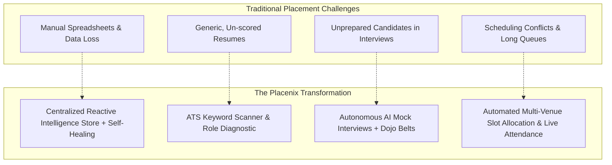
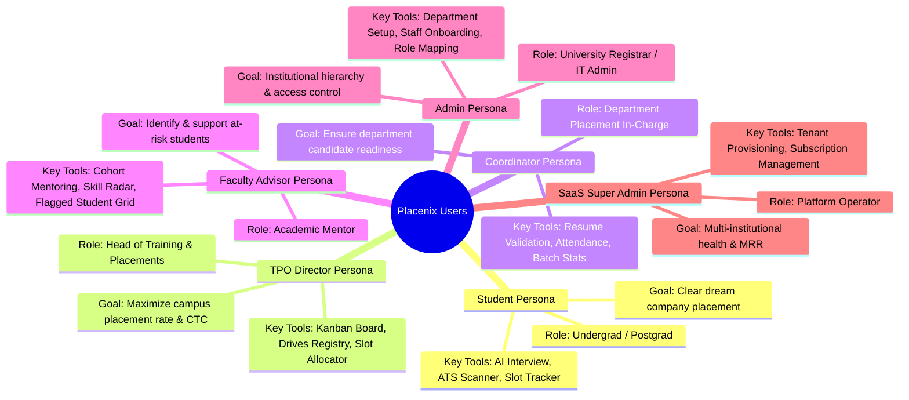
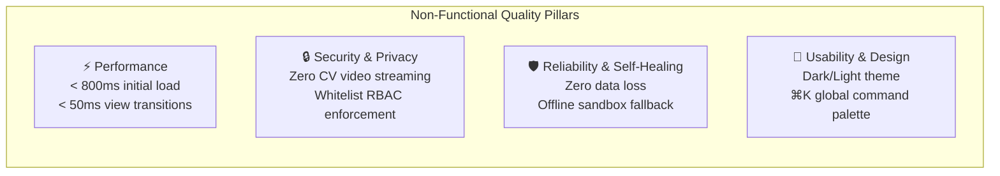
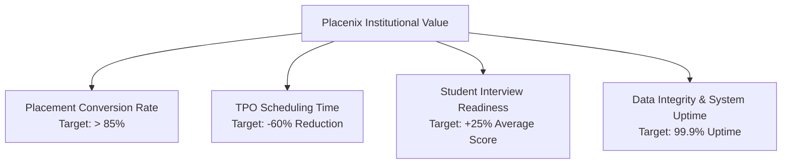

# Placenix — Product Requirements Document (PRD)
**AI-Powered Employability & Campus Recruitment Operating System**

---

## 1. Document Control & Product Metadata

| Parameter | Details |
| :--- | :--- |
| **Document Title** | Product Requirements Document (PRD) |
| **Product Name** | Placenix |
| **Product Version** | 3.0.0 (Production Release) |
| **Document Status** | Approved & Released |
| **Product Category** | EdTech / Higher Education SaaS / AI Recruitment OS |
| **Target Customers** | Universities, Engineering Institutes, Business Schools, Placement Directorates |

---

## 2. Product Vision & Problem Statement

### 2.1 The Problem
University campus placements represent one of the most operationally complex and mission-critical workflows in higher education. Currently, placement directorates face significant bottlenecks:
- **Fragmented Spreadsheets & Manual Overhead**: TPOs and department coordinators manage thousands of candidate records across disconnected Excel sheets, leading to data corruption, missing eligibility cutoffs, and scheduling conflicts.
- **Lack of Authentic AI Preparation**: Students enter high-stakes interviews without realistic, company-customized interview practice or real-time objective feedback.
- **ATS Resume Blindspots**: Candidates submit generic resumes that fail automated recruiter filters, lacking visibility into missing industry keywords.
- **Disconnected Stakeholders**: Faculty advisors lack visibility into which students in their cohorts are lagging in employability scores, preventing timely mentoring interventions.
- **Logistical Chaos in Scheduling**: Assigning hundreds of shortlisted candidates to limited physical interview venues and time slots during drive days is manual, slow, and prone to overlapping bookings.

### 2.2 Product Vision
**Placenix** provides a unified, intelligent, multi-role operating system that transforms campus placements into an automated, transparent, and data-driven ecosystem. By fusing **Google Gemini AI**, **on-device computer vision proctoring**, **real-time Kanban pipelines**, and **dynamic slot schedulers**, Placenix elevates student employability and simplifies recruitment logistics.

---

## 3. Target User Personas & User Journeys

### 3.1 Persona Summary & Key Objectives
| Persona | Primary Needs & Pain Points | Primary Placenix Views |
| :--- | :--- | :--- |
| **Student** | Needs company-specific preparation, instant resume feedback, and notification of interview timings. | `#student-dashboard`, `#virtual-interview`, `#resume-analysis`, `#employability`, `#my-slots`, `#new-applications` |
| **TPO / Placement Director** | Needs a consolidated cockpit to publish drives, monitor multi-round candidate funnels, allocate interview venues, and report placement metrics to university leadership. | `#tpo-dashboard`, `#drives`, `#kanban`, `#slot-allocation`, `#attendance-tracker`, `#analytics` |
| **Department Coordinator** | Needs to review resumes of departmental students, track round-wise interview attendance on drive days, and answer student queries. | `#coordinator-dashboard`, `#dept-students`, `#dept-resume`, `#dept-skills`, `#dept-announcements`, `#dept-queries` |
| **Faculty Advisor** | Needs to identify students with low CGPA ($< 7.0$) or weak employability readiness, conduct 1-on-1 counseling, and approve document verifications. | `#faculty-dashboard`, `#fa-students`, `#fa-resume`, `#fa-skills` |
| **Institutional Admin** | Needs to configure departments, define section counts (A, B, C), invite staff members, and assign role mappings. | `#admin-dashboard`, `#admin-setup`, `#admin-staff`, `#admin-roles`, `#admin-mapping` |
| **SaaS Super Admin** | Needs high-level telemetry across enrolled institutions, tracking student counts, placed percentages, and active MRR plans. | `#saas-admin` |
| **Alumni Mentor** | Needs a platform to share real interview experiences and offer consultation sessions to juniors. | `#alumni-connect`, `#interview-repo` |

---

## 4. Functional Requirements Matrix

### 4.1 Epic 1: Authentication, Identity & RBAC (Priority: P0 - Must Have)
- **FR-1.1**: The system must provide email/password login and signup with secure credential persistence.
- **FR-1.2**: The system must auto-resolve user roles from institutional email conventions (e.g. `fa.*` $\rightarrow$ `faculty`, `dept.*` $\rightarrow$ `coordinator`, `tpo.*` $\rightarrow$ `tpo`, `admin.*` $\rightarrow$ `admin`) or retrieve assigned roles from `profiles`.
- **FR-1.3**: The system must enforce whitelist-based route interception in `router.js`, blocking unauthorized role access and redirecting to the user's role home dashboard.
- **FR-1.4**: The system must support guest fallback into mock sandbox sessions when remote Supabase connections are offline.

---

### 4.2 Epic 2: Autonomous AI Virtual Interview Hub (Priority: P0 - Must Have)
- **FR-2.1 Dynamic Company & Role Selection**: Candidates can select any active campus drive (e.g., Google, Amazon, TCS, Microsoft) or enter custom roles.
- **FR-2.2 Multi-Round Simulation**:
  - **Round 1 (Aptitude)**: Exactly 30 questions generated via Google Gemini AI across Quants, Logical, Verbal, and Technical domains with countdown timer.
  - **Round 2 (Technical Coding)**: Live coding editor supporting JavaScript, Python, and SQL with real-time AI test-case evaluation.
  - **Round 3 & 4 (Communication & Behavioral HR)**: Real-time two-way voice interview using Web Speech API (SpeechRecognition for candidate answers, SpeechSynthesis for AI interviewer questions).
- **FR-2.3 Client-Side CV Proctoring**:
  - Continuous webcam face detection via TensorFlow.js BlazeFace.
  - Object detection via COCO-SSD for prohibited devices (`cell phone`, `book`).
  - Active tab-switch detection via `visibilitychange`.
  - Session termination upon reaching 3 violation warnings.
- **FR-2.4 Dojo Belt Gamification**: Candidates earn belt tiers (White to Black) based on cumulative performance and difficulty cleared.
- **FR-2.5 Diagnostic PDF Report**: Candidates can export an official Placenix evaluation report with score breakdowns, radar charts, and hiring recommendations.

---

### 4.3 Epic 3: AI Resume Intelligence & ATS Scoring (Priority: P0 - Must Have)
- **FR-3.1 Role Keyword Extraction**: Supports 18 target industry job roles (e.g. Full Stack Developer, Data Scientist, DevOps Engineer, Cloud Architect).
- **FR-3.2 ATS Score Calculation**: Calculates ATS match percentage (0–100) based on detected keywords and format density.
- **FR-3.3 Missing Keyword Identification**: Generates actionable lists of critical keywords missing from the candidate's resume.
- **FR-3.4 Scan History Persistence**: Caches the last 8 scans per user in `localStorage` for historical progress comparison.

---

### 4.4 Epic 4: 5-Pillar Employability Telemetry & Readiness (Priority: P0 - Must Have)
- **FR-4.1 5-Pillar Readiness Index**: Evaluates candidates across Technical (30%), Problem Solving (25%), Domain Knowledge (15%), Communication (15%), and Practical Execution (15%).
- **FR-4.2 Radar Chart Visualization**: Renders an interactive Chart.js radar chart displaying skill strengths and growth areas.
- **FR-4.3 Predictive Career Fit Matrix**: Computes match percentages for 4 alternative career paths based on profile telemetry.

---

### 4.5 Epic 5: Placement Drives & Multi-Round Kanban Pipeline (Priority: P0 - Must Have)
- **FR-5.1 Drive Master Registry**: TPOs can create, edit, close, and delete recruitment drives with CTC package, minimum CGPA, eligible departments, and custom rounds.
- **FR-5.2 Student Eligibility Filter**: Students can filter drives by `Eligible`, `Applied`, and `Super Dream (> 10 LPA)`.
- **FR-5.3 Interactive Drag-and-Drop Pipeline**: TPOs can drag candidate cards across recruitment stages (`Applied` $\rightarrow$ `Shortlisted` $\rightarrow$ `Round 1..N` $\rightarrow$ `Selected ✓`).
- **FR-5.4 Auto-Placed Sync**: Moving a candidate to `Selected ✓` automatically marks their profile as `Placed`, updates average CTC, and recalculates college placement metrics.

---

### 4.6 Epic 6: Automated Multi-Venue Slot Allocation & Attendance (Priority: P0 - Must Have)
- **FR-6.1 Multi-Venue Slicing Algorithm**: TPOs can configure $N$ physical venues with distinct seat capacities (e.g. Lab A: 30, Lab B: 20) and slot durations (e.g. 45 mins).
- **FR-6.2 Automated Batch Assignment**: Slices all shortlisted candidates evenly into time-venue slots without overlaps.
- **FR-6.3 Real-Time Notification Broadcast**: Dispatches personalized interview schedule alerts to candidates' notification trays and `#my-slots` views.
- **FR-6.4 Live Attendance Verification**: Department coordinators can mark candidate attendance as `Present` or `Absent` round-by-round during drive days.

---

### 4.7 Epic 7: Institutional Governance & Multi-Tenant SaaS (Priority: P1 - Should Have)
- **FR-7.1 Hierarchy Setup**: Admins can define institutional departments, degree programs, and section counts.
- **FR-7.2 Staff Authorization**: Admins approve staff registration requests and assign roles (`coordinator`, `faculty`, `tpo`).
- **FR-7.3 SaaS Platform Control**: Super Admins monitor multi-college tenants, active student counts, placed rates, and MRR metrics (`Starter`, `Pro`, `Enterprise` plans).

---

### 4.8 Epic 8: Communication, Alumni & Query Center (Priority: P1 - Should Have)
- **FR-8.1 Broadcast Announcements**: Coordinators and TPOs can publish targeted circulars to specific departments or batches.
- **FR-8.2 Student Query Desk**: Students submit queries; coordinators can resolve them directly or trigger AI-assisted resolution.
- **FR-8.3 Alumni Mentorship & Experience Archive**: Students search verified alumni mentors and read real interview experience narratives.

---

## 5. Non-Functional Requirements (NFRs)

| Dimension | Specification | Verification Method |
| :--- | :--- | :--- |
| **Performance** | Zero-build ES Modules architecture; static asset load $< 800\text{ ms}$; SPA client route swap $< 50\text{ ms}$. | Lighthouse Audit & Chrome DevTools Performance Trace |
| **Security & Privacy** | CV proctoring executes purely in-memory on WebGL canvas; no video feeds or biometric frames leave the client browser. | Network Request Inspection |
| **Reliability** | `healData()` auto-heals corrupted records on startup; dual-layer storage ensures full functionality even when Supabase is unreachable. | Network Disconnect Emulation |
| **Responsiveness** | Responsive layout across mobile ($320\text{px}$), tablet ($768\text{px}$), laptop ($1024\text{px}$), and ultrawide ($2560\text{px}$). | Cross-device viewport testing |
| **Theme System** | Instant theme switching (`data-theme="dark"` / `"light"`) with zero flash of unstyled content (FOUC). | DOM Mutation Observer |

---

## 6. Success Metrics & Key Performance Indicators (KPIs)

---

## 7. Product Roadmap & Future Milestones

| Milestone | Scope & Deliverables | Status |
| :--- | :--- | :--- |
| **Phase 1: Foundation** | Zero-build SPA shell, centralized `store.js`, Supabase auth, Whitelist RBAC, Drives registry, Multi-round Kanban board, Slot allocation engine. | **Completed (v1.0)** |
| **Phase 2: AI Intelligence** | Google Gemini `/api/ai` proxy, BlazeFace + COCO-SSD client proctoring, ATS resume scanner, 5-Pillar employability radar, Dojo belts. | **Completed (v2.0)** |
| **Phase 3: Multi-Tenancy** | SaaS super admin console, institutional department/staff mappings, resilient `healData()` self-healing data engine. | **Completed (v3.0)** |
| **Phase 4: Ecosystem (Next)** | WhatsApp / SMS automated notification gateway, Recruiter direct self-service interview portal, iOS/Android PWA wrapper. | **Planned (Q3 2026)** |
